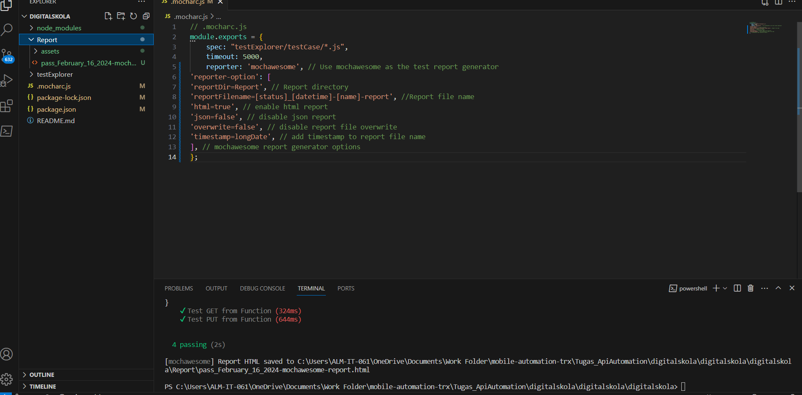
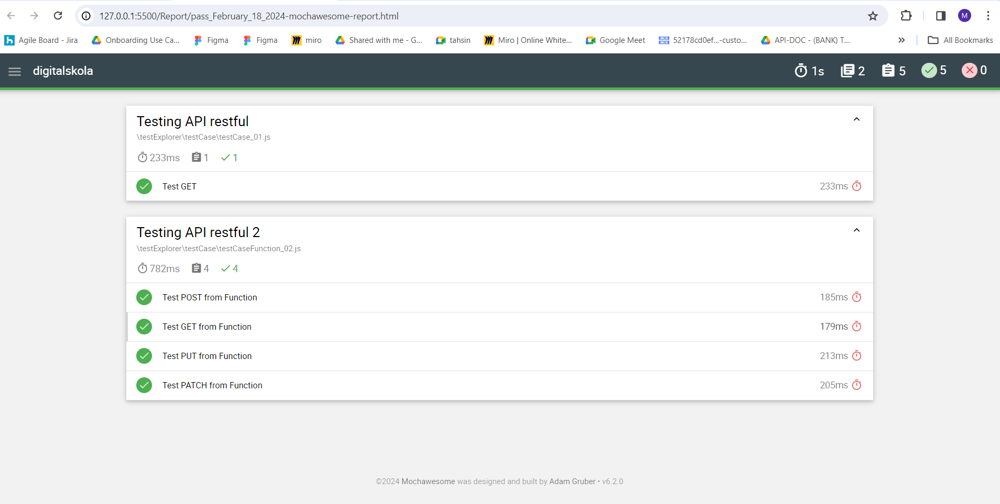

# digitalskola

# TUGAS API Automation web https://restful-api.dev/

### Step to Create The Project

1. Clone git hub
2. node -v
3. npm -v
4. npm init -y
5. npm install supertest --save-dev
6. npm install mocha --save-dev
7. npm i chai@4.3.0 --save-dev
8. Create folder "testExplorer"
9. Create folder inside folder "testExplorer" -> testCase
10. Then Create file inside folder "testCase" -> "testCaseFunction_02"
11. Create file ".mocharc.js" outside folder "testExplorer"
12. Fill file ".mocharc.js" with : 
    // .mocharc.js
    module.exports = {
    spec: "testExplorer/testCase/*.js",
    timeout: 5000,
    reporter : "spec", 
    }
13. Add in package.json under row test:echo,
    "test:mocha" : "mocha"
14. npm run test:mocha
15. Create folder inside folder "testExplorer" -> globalVariable
16. Create file inside folder "globalVariable" -> baseUrl.js
17. Fill file baseUrl with the url :
    const baseUrl = "https://api.restful-api.dev";
    module.exports = baseUrl;
18. Create folder "apiServer" inside folder "testExplorer"
19. Create file inside folder "apiServer" -> apiObjects.js
20. Try to create the function Method inside file "apiObjects.js"
21. And in file "testCaseFunction_02".js we can call the function Method
22. Then npm run test:mocha
23. Expected result is 5 passing, 0 failing

### Description about the Function Method

1. Create function postMethod   -> this function is for create data with the "id"
2. After that, save id after POST
3. Create function getMethod    -> this function is for call the "id" 
4. Create function putMethod    -> this function is for update / change data from POST
5. Create function patchMEthod  -> this function is for update partially data
6. Create the test case for calling all function Method

### Reporting

1. Install npm install --save-dev mochawesome
2. Update file ".mocharc.js" config with :
    reporter: 'mochawesome', // Use mochawesome as the test report generator
    'reporter-option': [
    'reportDir=Report', // Report directory
    'reportFilename=[status]_[datetime]-[name]-report', //Report file name
    'html=true', // enable html report
    'json=false', // disable json report
    'overwrite=false', // disable report file overwrite
    'timestamp=longDate', // add timestamp to report file name
    ], // mochawesome report generator options
3. npm run test:mocha
4. Will showing result Report HTML 
    
5. Then open the Report HTML

### Report

